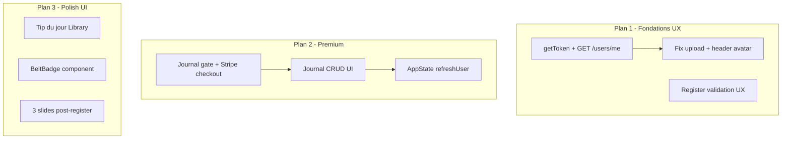
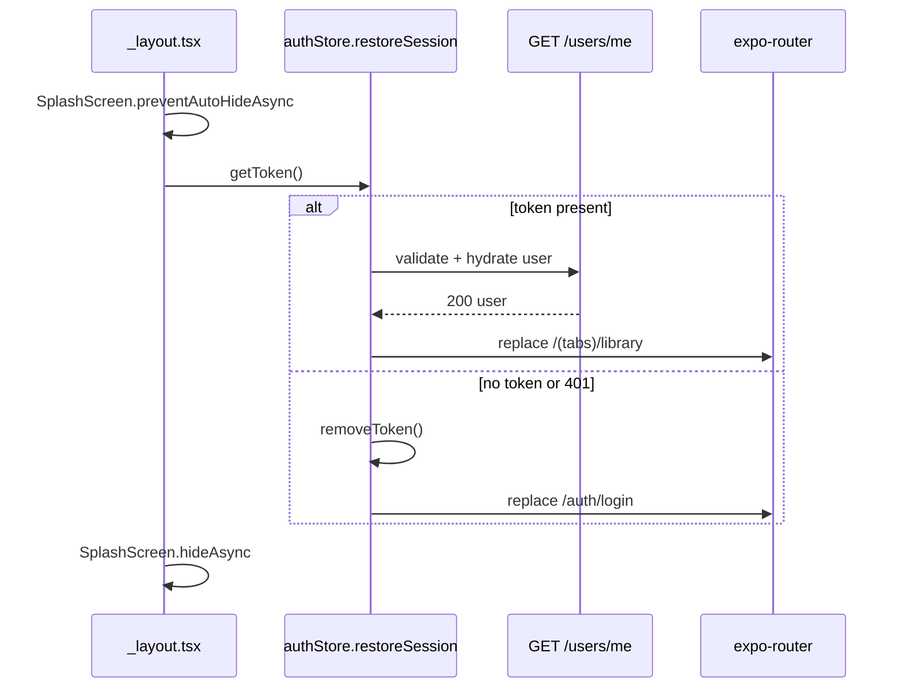

# Flip — 3 plans de développement indépendants

> **Comment relancer ce plan dans Cursor**
>
> Ouvre ce fichier et dis à l'agent, par exemple :
>
> - *« Implémente le Plan 1 de docs/PLAN_DEVELOPPEMENT.md »*
> - *« Exécute le todo p2-premium-gate »*
> - *« Go — Plan 1 fondations UX »*
>
> Chaque plan est **indépendant** et peut être livré séparément.

**Dernière mise à jour :** 2025-06-02

---

## Checklist

### Plan 1 — Fondations UX (priorité critique)
- [ ] `p1-auth-bootstrap` — restoreSession dans authStore + bootstrap SplashScreen dans `_layout.tsx`
- [ ] `p1-avatar-fix` — Fix upload avatar (HEIC, cache-bust, S3) + UserAvatar dans profile et Library header
- [ ] `p1-register-polish` — Validation email format + message 409 duplicate dans register/api.ts

### Plan 2 — Feature Premium (priorité haute)
- [ ] `p2-backend-migration` — Ajouter `002_journal_entries.sql` aux migrations auto du backend
- [ ] `p2-premium-gate` — PremiumGate + createCheckout + Linking.openURL + Restore purchase
- [ ] `p2-journal-crud` — types/hooks journal + JournalCard/FormModal + CRUD UI avec swipe delete
- [ ] `p2-subscription-refresh` — AppState listener + useFocusEffect journal pour refreshUser

### Plan 3 — Polish UI (priorité moyenne)
- [ ] `p3-daily-tip` — judoTips.ts + DailyTipCard dans Library index
- [ ] `p3-belt-badge` — Composant BeltBadge + remplacement emoji dans profile
- [ ] `p3-onboarding` — AsyncStorage onboarding_done + écran 3 slides + redirect register conditionnel

---

## État actuel (synthèse)

| Zone | Existant | Manquant |
|------|----------|----------|
| Auth cold start | JWT persisté dans `front/lib/auth.ts` | Bootstrap au démarrage ; `front/app/index.tsx` redirige toujours vers login après 2s |
| Register | Déjà branché sur `POST /auth/register` via `front/store/authStore.ts` | Validation format email ; message UX pour 409 |
| Avatar | Upload complet dans `front/app/(tabs)/profile.tsx` + backend `POST /users/me/avatar` | Bugs probables (HEIC iOS, URLs localhost sur Render, cache) ; avatar absent du header Library |
| Journal | Placeholder statique `front/app/(tabs)/journal.tsx` | Toute la couche front (gate, CRUD, billing) |
| Backend journal | Handlers + middleware premium prêts | Migration `002_journal_entries.sql` **non appliquée** au boot (seulement 003/004 dans `back/cmd/main.go` L123-126) |
| Polish UI | Emojis ceinture dans profile ; header Library texte seul | Tip du jour, BeltBadge, onboarding |



---

# Plan 1 — Fondations UX (priorité critique)

## 1.1 Persistance auth au cold start

**Problème :** Le JWT survit dans SecureStore, mais le store Zustand (`user`, `token`) est vide au redémarrage et `front/app/index.tsx` force `/auth/login`.

**Architecture cible :**



**Fichiers à modifier :**

- `front/store/authStore.ts` — ajouter :
  - `isBootstrapping: boolean` (initial `true`)
  - `restoreSession(): Promise<'authenticated' | 'unauthenticated'>` :
    1. `getToken()` depuis `front/lib/auth.ts`
    2. Si absent → `unauthenticated`
    3. Si présent → `GET /users/me` via `apiFetchAuth`, setter `{ user, token }`
    4. Sur 401/erreur réseau auth → `removeToken()`, `unauthenticated`
- `front/app/_layout.tsx` — bootstrap principal :
  - `expo-splash-screen` : `preventAutoHideAsync()` au mount, `hideAsync()` quand `isBootstrapping === false`
  - Appeler `restoreSession()` puis router selon le résultat
  - Tant que bootstrapping : rendre `null` ou un écran neutre (le splash natif reste visible)
- `front/app/index.tsx` — simplifier : animation logo uniquement, **sans** redirect hardcodée (le routing auth est géré par `_layout.tsx`)

**Dépendance à ajouter :** `expo-splash-screen` (`npx expo install expo-splash-screen`)

**Note :** Pas de garde auth sur `(tabs)` dans ce plan — le cold start suffit pour le flux normal. Optionnel : redirect login si `!user` dans `(tabs)/_layout.tsx`.

---

## 1.2 Fix upload photo de profil

**Diagnostic (ordre de vérification) :**

1. **iOS HEIC** — `expo-image-picker` peut retourner `image/heic` ; le backend n'accepte que JPEG/PNG/WebP (`back/internal/service/profile.go`). Forcer JPEG :
   - `mediaTypes: ImagePicker.MediaTypeOptions.Images` + `preferredAssetRepresentationMode: 'compatible'` (SDK 51+)
   - Fallback : si `mimeType` contient `heic`, envoyer `type: 'image/jpeg'` et laisser le backend détecter via magic bytes
2. **Render sans S3** — disque éphémère ; vérifier `S3_BUCKET` + `S3_PUBLIC_BASE_URL` sur Render (log warning déjà présent L151-152 de `main.go`)
3. **URL avatar inaccessible** — `AVATAR_PUBLIC_BASE_URL` doit pointer vers l'hôte reachable par le device (pas `localhost` en dev mobile). Aligner avec `front/constants/api.ts`
4. **Cache stale** — URL stable `/avatars/{userId}.jpg` ; ajouter `?t=${Date.now()}` côté affichage après upload
5. **Multipart** — `front/lib/api.ts` L136-162 : ne **pas** setter `Content-Type` manuellement (fetch boundary auto) ; garder `Authorization` Bearer only

**Corrections front :**

- `front/lib/api.ts` — normaliser mime HEIC → JPEG dans `uploadAvatar`
- `front/app/(tabs)/profile.tsx` — options picker iOS ; cache-bust sur `expo-image` source
- **Nouveau composant** `front/components/UserAvatar.tsx` — réutilisable (taille, loading, initial fallback via `avatarInitial()` du store)
- `front/app/(tabs)/library/index.tsx` — intégrer `UserAvatar` dans le header à côté du username

**Permissions iOS :** déjà configurées dans `front/app.json` plugin `expo-image-picker`. Rebuild dev client requis après changement.

**Test manuel Render :** `POST /users/me/avatar` avec curl multipart + vérifier que `user.avatar_url` est une URL publique S3.

---

## 1.3 Écran Register connecté

**État :** Déjà fonctionnel — `front/app/auth/register.tsx` appelle `register()` → JWT → redirect Library (L57-58).

**Travail restant (polish) :**

| Exigence | Action |
|----------|--------|
| Email format | Ajouter regex simple dans `handleSignUp` (ex. `/^[^\s@]+@[^\s@]+\.[^\s@]+$/`) avant l'appel API |
| Password ≥ 8 | Déjà implémenté L46-48 |
| Email déjà utilisé | Backend renvoie 409 `"email already registered"` (`back/internal/handler/auth.go` L46). Mapper dans `front/lib/api.ts` `authRouteMessage` pour status 409 → message FR/EN clair |
| Redirect Library | Déjà en place ; après Plan 3, deviendra redirect onboarding si flag absent |

**Fichiers :** `front/app/auth/register.tsx`, `front/lib/api.ts` (message 409)

---

### Livrables Plan 1

- Session restaurée au cold start sans re-login
- Avatar upload fonctionnel iOS + affiché profil et Library
- Register avec validation email et erreur duplicate explicite

### Dépendances Plan 1

- `expo-splash-screen` (obligatoire)
- Optionnel prod : config S3 Render (infra, pas npm)

---

# Plan 2 — Feature Premium (priorité haute)

## Prérequis backend

Ajouter `"002_journal_entries.sql"` à `ApplyMigrations` dans `back/cmd/main.go` L123-126, ou exécuter `go run ./cmd/migrate` manuellement sur Neon/Render.

---

## 2.1 PremiumGate — écran Journal pour free users

**Fichier principal :** `front/app/(tabs)/journal.tsx`

**Logique :**

```tsx
const isPremium = user?.subscription_status === 'active';
if (!isPremium) return <PremiumGate />;
return <JournalList />;
```

**Nouveau composant** `front/components/PremiumGate.tsx` :

- Logo Flip + titre "Unlock your training journal"
- Liste features : journal, stats, historique illimité
- CTA primary : "Get Premium — 4.99 CAD/month" → `createCheckout()` → `Linking.openURL(url)`
- CTA secondary : "Restore purchase" → `refreshUser()` + toast/alert si toujours `free`

**Nouveau helper** `front/lib/billing.ts` ou section dans `front/lib/api.ts` :

```ts
export async function createCheckout(): Promise<{ url: string }> {
  return apiFetchAuth('/billing/checkout', { method: 'POST' });
}
```

Backend existant : `back/internal/handler/billing.go` `CreateCheckout` → `{ url }`.

**Note :** Pas d'endpoint "restore" dédié — "Restore purchase" = re-sync via `GET /users/me` (webhook Stripe a déjà mis à jour la DB).

---

## 2.2 Journal CRUD complet

**Types** — `front/types/journal.ts` :

```ts
export type JournalEntry = {
  id: string;
  session_date: string; // YYYY-MM-DD
  duration_minutes: number;
  intensity: number; // 1-5
  notes: string;
  created_at: string;
};
```

**Hook** — `front/hooks/useJournal.ts` :

- `fetchEntries()` → `GET /journal` → `{ data, count }`
- `createEntry(payload)` → `POST /journal`
- `updateEntry(id, payload)` → `PUT /journal/{id}`
- `deleteEntry(id)` → `DELETE /journal/{id}`
- État : `entries`, `loading`, `error`, `refresh`

**UI composants :**

| Composant | Rôle |
|-----------|------|
| `front/components/journal/JournalCard.tsx` | Date formatée, durée, étoiles intensité, aperçu notes (2 lignes) |
| `front/components/journal/JournalFormModal.tsx` | Create/Edit : DatePicker, durée (TextInput numérique), slider intensité 1-5, notes multiline |
| `front/components/journal/IntensityStars.tsx` | Affichage + sélection étoiles |

**Écran Journal (premium) :**

- `FlatList` de `JournalCard`
- FAB "+" → modal création
- Tap card → modal édition (pré-remplie)
- Swipe left → confirm → `deleteEntry`

**Swipe delete :** `react-native-gesture-handler` `Swipeable` (`npx expo install react-native-gesture-handler`). Alternative sans nouvelle dep : bouton delete dans modal edit.

**DatePicker :** `@react-native-community/datetimepicker` (`npx expo install @react-native-community/datetimepicker`)

**Validation front (alignée backend) :**

- Intensity 1-5
- `session_date` ≤ aujourd'hui
- `duration_minutes` > 0

---

## 2.3 Refresh subscription status

**Fichier :** `front/app/_layout.tsx` ou hook dédié `front/hooks/useSubscriptionRefresh.ts`

```ts
useEffect(() => {
  const sub = AppState.addEventListener('change', (state) => {
    if (state === 'active') refreshUser().catch(() => {});
  });
  return () => sub.remove();
}, []);
```

Compléter avec `useFocusEffect` sur `front/app/(tabs)/journal.tsx` pour refresh à l'ouverture de l'onglet.

**Flux post-paiement :**

1. User paie via Stripe Checkout (navigateur externe)
2. Webhook met `subscription_status = 'active'`
3. User revient à l'app → AppState `active` → `refreshUser()`
4. Journal tab bascule automatiquement sur CRUD

---

### Livrables Plan 2

- Free users voient PremiumGate avec checkout Stripe fonctionnel
- Premium users ont journal CRUD complet
- Subscription status se met à jour au retour app sans logout

### Dépendances Plan 2

- `@react-native-community/datetimepicker`
- `react-native-gesture-handler` (si swipe delete)
- Backend : migration 002 appliquée

---

# Plan 3 — Polish UI (priorité moyenne)

## 3.1 Tip du jour sur l'écran principal

**Nouveau fichier** `front/constants/judoTips.ts` — tableau statique de 20 entrées :

```ts
{ quote: string; author: string }[]
```

**Sélection :** `dayOfYear = Math.floor((Date.now - jan1) / 86400000) % 20`

**Nouveau composant** `front/components/DailyTipCard.tsx` :

- Fond `#FFFFFF`, `borderLeftWidth: 4`, `borderLeftColor: '#84714F'`
- Citation en italique + auteur (ou "Jigoro Kano" par défaut)
- Padding compact, border-radius cohérent avec les cards Library

**Intégration :** `front/app/(tabs)/library/index.tsx` — placer `DailyTipCard` dans le header fixe, entre le séparateur et le `ScrollView`.

---

## 3.2 Badge ceinture coloré dans le profil

**Nouveau composant** `front/components/BeltBadge.tsx` :

```ts
const BELT_COLORS = {
  white:  { fill: '#FFFFFF', border: '#E8E0D0' },
  yellow: { fill: '#FFD700' },
  orange: { fill: '#FF8C00' },
  green:  { fill: '#2D6A4F' },
  blue:   { fill: '#2563EB' },
  brown:  { fill: '#84714F' },
  black:  { fill: '#1A1A1A' },
};
```

- View 60×12px, `borderRadius: 4`, centré
- Label ceinture en dessous (`beltEntry(belt).label`)
- White belt : border 1px `#E8E0D0`

**Refactor** `front/app/(tabs)/profile.tsx` :

- Remplacer `statEmoji` par `<BeltBadge belt={belt} />` dans la stat card
- Conserver `BELTS` constant pour le picker modal

---

## 3.3 Onboarding pour les nouveaux users

**Dépendance :** `@react-native-async-storage/async-storage` (`npx expo install @react-native-async-storage/async-storage`)

**Helper** `front/lib/onboarding.ts` :

- `ONBOARDING_KEY = 'onboarding_done'`
- `isOnboardingDone()` / `setOnboardingDone()`

**Nouvel écran** `front/app/onboarding/index.tsx` :

- 3 slides (FlatList horizontal paginé ou state `step 0|1|2`)
- Slide 1 : logo + "Welcome to Flip" + "Your judo companion"
- Slide 2 : "Explore techniques" + emoji/illustration Library
- Slide 3 : "Track your progress" + emoji Journal + bouton "Get started"
- Navigation : swipe horizontal + bouton "Next" / "Get started" sur slide 3
- Slide 3 CTA : `setOnboardingDone()` → `router.replace('/(tabs)/library')`

**Routing (register uniquement) :**

Modifier `front/app/auth/register.tsx` post-success :

```ts
const done = await isOnboardingDone();
router.replace(done ? '/(tabs)/library' : '/onboarding');
```

Login reste → Library direct (pas d'onboarding).

---

### Livrables Plan 3

- Citation judo quotidienne sur Library
- Ceinture visuelle colorée au profil
- Onboarding 3 slides une seule fois après register

### Dépendances Plan 3

- `@react-native-async-storage/async-storage`

---

## Ordre d'implémentation recommandé

1. **Plan 1** en premier — débloque l'expérience de base (session, avatar, register)
2. **Plan 2** — monetization + feature différenciante
3. **Plan 3** — polish sans dépendance bloquante (sauf onboarding qui modifie le redirect register)

## Points d'intégration entre plans

- Plan 1 `restoreSession` + Plan 2 `AppState refreshUser` → même store, pas de conflit
- Plan 1 redirect register → Library ; Plan 3 change ce redirect conditionnellement
- Plan 1 `UserAvatar` réutilisable partout ; Plan 3 peut l'utiliser dans onboarding slides
- Plan 2 PremiumGate et Plan 3 onboarding slide 3 partagent le messaging "Track your progress"

## Tests manuels par plan

**Plan 1 :** Kill app → relaunch → Library si token valide ; upload photo iOS ; register email dupliqué

**Plan 2 :** Free user → PremiumGate → checkout URL ouvre ; simuler webhook → retour app → journal accessible ; CRUD entrées

**Plan 3 :** Tip change demain (ou mock date) ; ceintures toutes couleurs ; register nouveau compte → onboarding → second login skip onboarding
